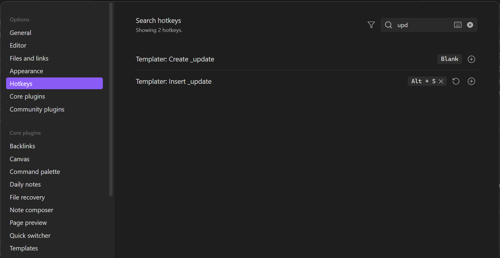
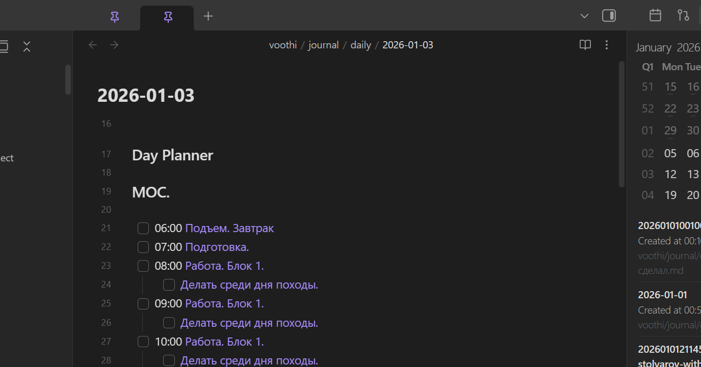

# Daily Note & Planner

This folder contains the templates and configuration details for the daily journaling and planning workflow.

## Table of Contents
- [Daily Structure](#daily-structure)
  - [Features](#features)
  - [Visual Guide](#visual-guide)
- [Calendar Integration](#calendar-integration)
  - [Recommended Settings](#recommended-settings)
  - [Visual Guide](#visual-guide-1)
- [Healthy Habits & Workflow](#healthy-habits--workflow)

---

## Daily Structure
[day-planner.md](../../vault/templates/day-planner.md)
A high-density planning template designed for focus and productivity.

### Features
- **Hourly Schedule**: Pre-formatted blocks from 06:00 to 23:00.
- **ZID-based**: Deeply integrated with Zettelkasten IDs for referring to specific projects or tasks.
- **MOC Focus**: Direct link to the daily Map of Content.
- **Habit Tracking**: Incorporated slots for health (e.g., meditation, walking) and personal growth.

### Visual Guide
| Day Planner Template | Day Planner in Action |
| :--- | :--- |
|  |  |

[Return to Top](#table-of-contents)

## Calendar Integration
The **Daily Note Calendar** plugin provides the primary interface for navigating your journal.

### Recommended Settings
- **Display notes created on selected date**: Enabled.
- **Display an indicator on each date**: Enabled.
- **Date Format**: `yyyy-MM-dd`
- **Notes Folder**: `voothi/journal/daily`
- **Template**: `templates/day-planner.md`

### Visual Guide

[Return to Top](#table-of-contents)

## Healthy Habits & Workflow
The template encourages a disciplined daily routine:
1. **Morning**: Review MOC and set blocks.
2. **Day**: Log activities using ZID links for precision.
3. **Evening**: Summary and reflection.

[Return to Top](#table-of-contents)