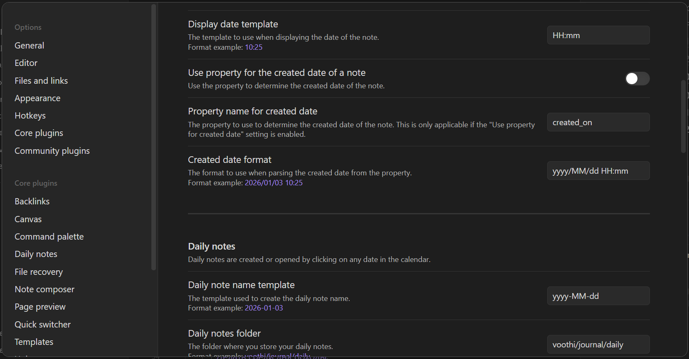
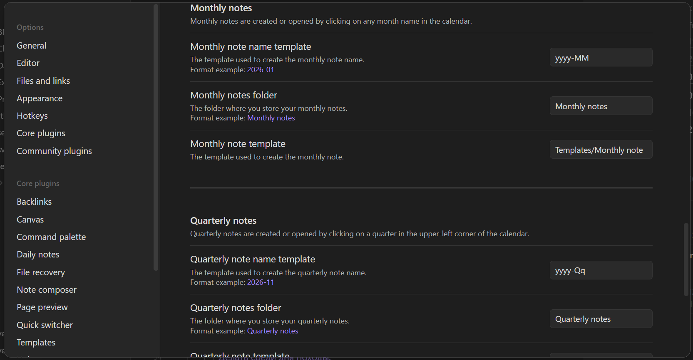
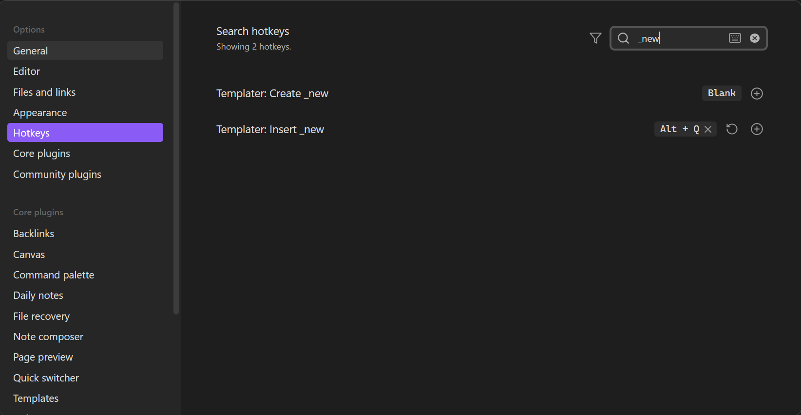
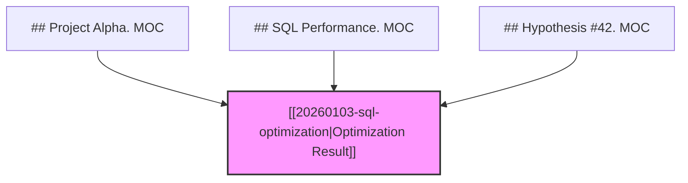

# Templater Automation Scripts

[](https://github.com/SilentVoid13/Templater)

This folder contains the core automation logic for the **ZID-based methodology**. These scripts manage note creation, name sanitization, and hierarchical synchronization.

## Table of Contents
- [Smart Note Creation](#smart-note-creation)
  - [Features](#features)
  - [Visual Guide](#visual-guide)
- [Seamless Renaming](#seamless-renaming)
  - [Features](#features-1)
  - [Visual Guide](#visual-guide-1)
- [Automated Graph](#automated-graph)
  - [Features](#features-2)
  - [Visual Guide](#visual-guide-2)
- [The MOC Engine](#the-moc-engine)
  - [1. The Trigger Syntax](#1-the-trigger-syntax)
  - [2. Logical Multi-Node Chains](#2-logical-multi-node-chains-many-to-many)
  - [3. Real-World Examples: Core MOCs](#3-real-world-examples-core-mocs)
  - [4. Tree Formation: Vertical & Horizontal Chains](#4-tree-formation-vertical--horizontal-chains)
  - [5. Technical Limitations & Synchronization Logic](#5-technical-limitations--synchronization-logic)
- [Usage Examples](#usage-examples)
  - [Case 1: ZID Lines to Linked Notes](#case-1-convert-raw-zid-lines-to-linked-notes)
  - [Case 2: In-line Selection](#case-2-in-line-selection-new-note-from-text)
  - [Case 3: Selecting Multiple Sentences](#case-3-selecting-multiple-sentences)
  - [Case 4: Process Existing Wikilinks](#case-4-process-existing-wikilinks)
  - [Case 5: Multi-Language Knowledge Base](#case-5-multi-language-knowledge-base-zid-pivot)
  - [Case 6: Non-Linear Reasoning](#case-6-non-linear-reasoning-the-ai-web)
- [Behind the Scenes](#behind-the-scenes-metadata--safety)
  - [1. Metadata Inheritance](#1-metadata-inheritance)
  - [2. Safety First](#2-safety-first)
- [Installation & Hotkeys](#installation--hotkeys)

---

## Smart Note Creation
[_new.md](../../vault/templates/_new.md)

Automates the process of turning Zettelkasten IDs (ZIDs) or plain text into formatted notes.

### Features
- **ZID Parsing**: Recognizes 14-digit timestamps ([ZIDs](../../README.md#the-zid-system-philosophy--standards)) and converts them into note titles.
- **Sanitization**: Automatically handles umlauts (`ö` -> `oe`), spaces, and special characters for cross-platform compatibility.
- **Description Split**: If enabled, splits the first sentence into the note title and treats the rest as the body description.
- **Enforced Slug Length**: Automatically limits the filename slug to a specific number of words (Default: **4**) to keep the vault clean. This is configurable via the `SLUG_WORD_COUNT` setting in the script header.
- **Batch Processing**: Select multiple lines of ZIDs or links and process them all at once.

### Visual Guide
| Input ZID Lines | Resulting linked Note |
| :--- | :--- |
|  |  |

| Batch Input | Batch Result |
| :--- | :--- |
|  |  |

[Return to Top](#table-of-contents)

## Seamless Renaming
[_update.md](../../vault/templates/_update.md)

Ensures that human-readable titles remain consistent throughout the vault.

### Features
- **Alias Management**: Synchronizes the first `aliases` entry in YAML with the file's H1 header.
- **Backlink Automation**: Searches the entire vault for links pointing to the current note and updates their display text to match the new H1 title.

### Visual Guide
| Alias Update | Backlink Refresh |
| :--- | :--- |
|  |  |

[Return to Top](#table-of-contents)

## Automated Graph
[_moc.md](../../vault/templates/_moc.md)

The structural engine of the vault. It scans for specific headers to build and maintain the logical graph of your notes.

### Features
- **Key Syntax**: Matches any header containing `MOC.` (e.g., `## MOC.` or `## Project Alpha. MOC`).
- **Automation**: Automatically populates the `up` field in the frontmatter of linked notes based on their position under an MOC header.
- **Hierarchical Depth**: Supports nested list indentation to map complex parent-child relationships.
- **Frontmatter Automation**: Updates the `up` field in child notes for breadcrumb-style navigation.

### Visual Guide
| MOC Scanning | Frontmatter Update |
| :--- | :--- |
|  |  |

[Return to Top](#table-of-contents)

## The MOC Engine

### 1. The Trigger Syntax
The script triggers on headers that follow a specific pattern: `# MOC.` or `## [Topic]. MOC`.

> [!IMPORTANT]
> **The Dot Matters**: The script's logic is strictly keyed to identify the string `MOC.` (with the period). This prevents it from accidentally processing random text while allowing for descriptive headers like `## Biology Research. MOC`.

### 2. Logical Multi-Node Chains (Many-to-Many)
This system implements the **[Workflowy](https://workflowy.com/) outliner approach**, but applies it to **atomic flat files** rather than **nested bullet lists**. You maintain a flat storage of independent notes, while the MOC files describe the "map of connections" between them.

This provides extreme **flexibility**. Unlike a rigid folder tree, a single note can belong to multiple branches of your knowledge base.

- **How it works**: If you list `[[ZID-Atomic-Note]]` under three different MOC sections in three separate files, the `_moc.md` script will aggregate all three parents into the `up` field of that note's frontmatter.
- **The Result**: A truly networked knowledge base where nodes participate in several logical chains simultaneously.

### 3. Real-World Examples: Core MOCs
The vault's entry points are powered by this engine. See how the root connects to the main structure:

- **[Root](../../vault/voothi/root.md)**: The "Zero-Level" entry point.
- **[Structure MOC](../../vault/voothi/20220207182435-structure-moc.md)**: The primary index for all major categories (Health, Work, Knowledge, etc.).

When you run `_moc.md`, every child listed in the Structure MOC automatically receives `up: "[[20220207182435-structure-moc]]"` in its frontmatter.

### 4. Tree Formation: Vertical & Horizontal Chains
The engine builds the logical tree using two rules:
1. **Vertical (Indentation)**: Indented items are children of the line above them.
   - *Example*:
     ```markdown
     - [[20250803220646-work|Work.]]
         - [[20250805215439-regular-routines|Regular routines.]]
     ```
   - *Result*: `Regular routines.` receives `up: [[20250803220646-work]]`.
2. **Horizontal (Same-Line)**: Multiple links on a single line form a chain from left-to-right.
   - *Example from day-planner.md*:
     ```markdown
     - [ ] 18:00 [[20250803220646-work|Work.]] [[20250803220746-block-3|Block 3.]] [[20250803220751-personal-development|Personal Development.]]
     ```
   - *Result*: `Block 3.` becomes a child of `Work.`, and `Personal Development.` becomes a child of `Block 3.`.

### 5. Technical Limitations & Synchronization Logic
Understanding how the sync handles changes is critical. The script enforces a **Single Source of Truth** model.

#### The MOC is the Master
- **Unidirectional Sync**: The structure defined in your `# MOC.` sections is the **only** authority for the hierarchy.
- **Overwrite Behavior**: When you run `_moc.md`, the script **overwrites** the `up` field in every child note.
  - *Why?* To ensure the logical graph (Frontmatter) perfectly matches the visual map (MOCs). If you manually edit the `up` field in a note, your changes will be **erased** on the next sync unless you also update the MOC.

#### Hierarchy Formation
The parent for any node is determined by:
1.  **The File**: If a link is at the root of a `# MOC.` section, its parent is the **MOC File itself**.
2.  **The Indentation**: If a link is indented, its parent is the **list item directly above it**.

#### Merge & De-duplicate Logic
What happens if a node appears multiple times?
- **Same Parent, Multiple Places**: If `[[Node A]]` is listed under `[[Parent B]]` in two different files, the script **de-duplicates** the entry. `Node A` will have `up: [[Parent B]]` only once.
- **Different Parents (Polymorphism)**: If `[[Node A]]` is listed under `[[Parent B]]` and also under `[[Parent C]]`, the script **merges** them. `Node A` will have `up: [[Parent B]], [[Parent C]]`.

#### What happens if I delete a node?
- **Partial Deletion (Survivor Logic)**: If a node is removed from *one* MOC but exists in another (or even in a branch of the same MOC), the script effectively "garbage collects" the dead link. It updates the `up` field to remove the deleted parent while **preserving** the surviving parents.
- **Orphan (Full Deletion)**: Only when a link is removed from **all** MOC sections does the engine surgically **clear** the `up` field entirely.

#### Synchronization Hooks
- **Global Scope**: `_moc.md` scans the *entire* vault. It is a "heavy" operation designed for periodic structural alignment.
- **No Residual Data**: Because the script maintains a full map of the vault, it is the only way to ensure "deleted" relationships don't linger in your metadata.

[Return to Top](#table-of-contents)

## Usage Examples

### Case 1: Convert Raw ZID Lines to Linked Notes
Turn a selection of lines starting with 14-digit timestamps (ZIDs) into clean Wikilinks.

**Input (Selection):**
```text
20251226135208 This is the first sentence of the first entry. This is the second sentence which moves inside.

- [ ] 20251226135257 This is the first sentence of the second entry.
```

**Output (Updated Selection):**
```text
[[20251226135208-this-is-the-first-sentence-of-the-first-entry|This is the first sentence of the first entry.]]

- [ ] [[20251226135257-this-is-the-first-sentence-of-the-second-entry|This is the first sentence of the second entry.]]
```

**Active Links (Obsidian/Internal):**
- [[20251226135208-this-is-the-first-sentence-of-the-first-entry|This is the first sentence of the first entry.]]
- [[20251226135257-this-is-the-first-sentence-of-the-second-entry|This is the first sentence of the second entry.]]

**What happens:**
- **Sanitization**: Filenames/Wikilinks are automatically sanitized (handling spaces, special characters, and umlauts) while preserving the **original input language**.
- **Title Extraction**: The first sentence (up to the first `.`) becomes the Wikilink label.
- **Content Migration**: The second sentence ("This is the second sentence...") is moved to the new note's description.
- **Batching**: Processes all selected ZID lines simultaneously while preserving list markers.

### Case 2: In-line Selection (New Note from Text)
Highlight a phrase within an existing sentence to extract it into a new note.

**Action:**
1. You have a sentence like: "We should discuss the **Kardenwort Ecosystem** later today."
2. Highlight **Kardenwort Ecosystem**.
3. Run `Alt + Q`.

**Result:**
- The text is replaced with: `[[20260103204319-kardenwort-ecosystem|Kardenwort Ecosystem]]`
- A new file is created with that ZID and title.

### Case 3: Selecting Multiple Sentences
What happens if your selection contains more than one sentence?

**Input (Selection):**
```text
The Architecture of Knowledge. It focuses on modularity and ZIDs.
```

**Action:**
Highlight both sentences and run `Alt + Q`.

**Result:**
- **Link Title**: `The Architecture of Knowledge.` (The first sentence).
- **Slug**: `YYYYMMDDHHMMSS-the-architecture-of-knowledge` (First 4 words preserved).
- **New Note Content**: The second sentence ("It focuses on modularity and ZIDs.") is placed inside the note's **Description** section.

> [!NOTE]
> The script uses simple punctuation detection (`.`, `?`, `!`) to perform this split, ensuring your main note stays concise while the details are offloaded to the atomic note.

### Case 4: Process Existing Wikilinks
If your selection contains Wikilinks that point to non-existent files (e.g., `[[Future Concept]]`), the script will generate the `.md` files for them without changing your original text. This is perfect for "filling in" the red links in a Map of Content.

### Case 5: Multi-Language Knowledge Base (ZID Pivot)
How do you maintain the same thought across several languages (Russian, English, German)? You anchor them with the same **ZID**, using the slug to define the language.

**Input (Four translations, same ZID):**
```text
- [ ] 20260103220434 Создать кнопку "Сделай всё хорошо" для пользователя системы.
- [ ] 20260103220434 Create a “Do everything well” button for the system user.
- [ ] 20260103220434 Erstellen Sie einen „Alles gut machen“-Button für den Systembenutzer.
```

**Output after `Alt + Q` (Four unique files, one indexable ID):**
```text
- [ ] [[20260103220434-создать-кнопку-сделай-всё|Создать кнопку "Сделай всё хорошо" для пользователя системы.]]
- [ ] [[20260103220434-create-a-do-everything|Create a “Do everything well” button for the system user.]]
- [ ] [[20260103220434-erstellen-sie-einen-alles|Erstellen Sie einen „Alles gut machen“-Button für den Systembenutzer.]]
```

**Active Links (Obsidian/Internal):**
- [[20260103220434-создать-кнопку-сделай-всё|Создать кнопку "Сделай всё хорошо" для пользователя системы.]]
- [[20260103220434-create-a-do-everything|Create a “Do everything well” button for the system user.]]
- [[20260103220434-erstellen-sie-einen-alles|Erstellen Sie einen „Alles gut machen“-Button für den Systembenutzer.]]

**Why this works:**
- **ZID as Anchor**: Searching for `20260103220434` will immediately list all available translations in your vault.
- **Independence**: Each file is its own atomic unit with its own descriptive slug, yet they are logically tied together forever.

### Case 6: Non-Linear Reasoning (The AI Web)
The system allows a single unit of reasoning (an AI result, a hypothesis, a code snippet) to participate in **multiple logical chains** simultaneously. You can "twist" your knowledge base to look at the same data from different professional perspectives.

**Example Scenario**: An AI provides a critical SQL optimization for a specific project.



**How it works**:
1. **The Node**: You create one note: `[[20260103120000-sql-optimization]]`.
2. **The Links**: You place this link into three different MOC files:
   - Your **Project dashboard** (for task completion).
   - Your **SQL Knowledge base** (for future reference).
   - Your **Experiment log** (for comparing AI hypotheses).
3. **The Sync**: Running `_moc.md` automatically updates the note's frontmatter to reflect its three parents:
   ```yaml
   up:
     - "[[Project Alpha]]"
     - "[[SQL Performance]]"
     - "[[Hypothesis #42]]"
   ```

**The Strategic Advantage**: Unlike folders, where you must choose *one* home for a file, this system allows information to live everywhere it is relevant. You can branch, compare, and merge logical paths at will.

[Return to Top](#table-of-contents)

---

## Behind the Scenes: Metadata & Safety

### 1. Metadata Inheritance
Every note created via `_new.md` is "born" with context:
- **`up` field**: Automatically points back to the note where you ran the script (parent-child relationship).
- **`tags`**: Inherits all tags from the parent note (both from YAML and the body).
- **`aliases`**: The primary title is automatically added to the aliases list.

### 2. Safety First
- **No Overwrites**: If a file with the same ZID-slug already exists, the script will **skip** creation to prevent data loss.
- **Sanitized Filenames**: Ensures all filenames are lowercase and cross-platform compatible (removing invalid characters like `:`, `_`, or trailing dots).

[Return to Top](#table-of-contents)

## Installation & Hotkeys

To use these scripts, copy them to your Templater templates folder and assign the following hotkeys:

| Script | Hotkey | Function |
| :--- | :--- | :--- |
| `_new.md` | `Alt + Q` | Create notes from selection |
| `_moc.md` | `Alt + A` | Synchronize Global MOCs |
| `_update.md` | `Alt + S` | Update titles & backlinks |

[Return to Top](#table-of-contents)2. **Horizontal (Same-Line)**: Multiple links on a single line form a chain from left-to-right (e.g., `- [[Parent]] [[Child]] [[Grandchild]]`).
